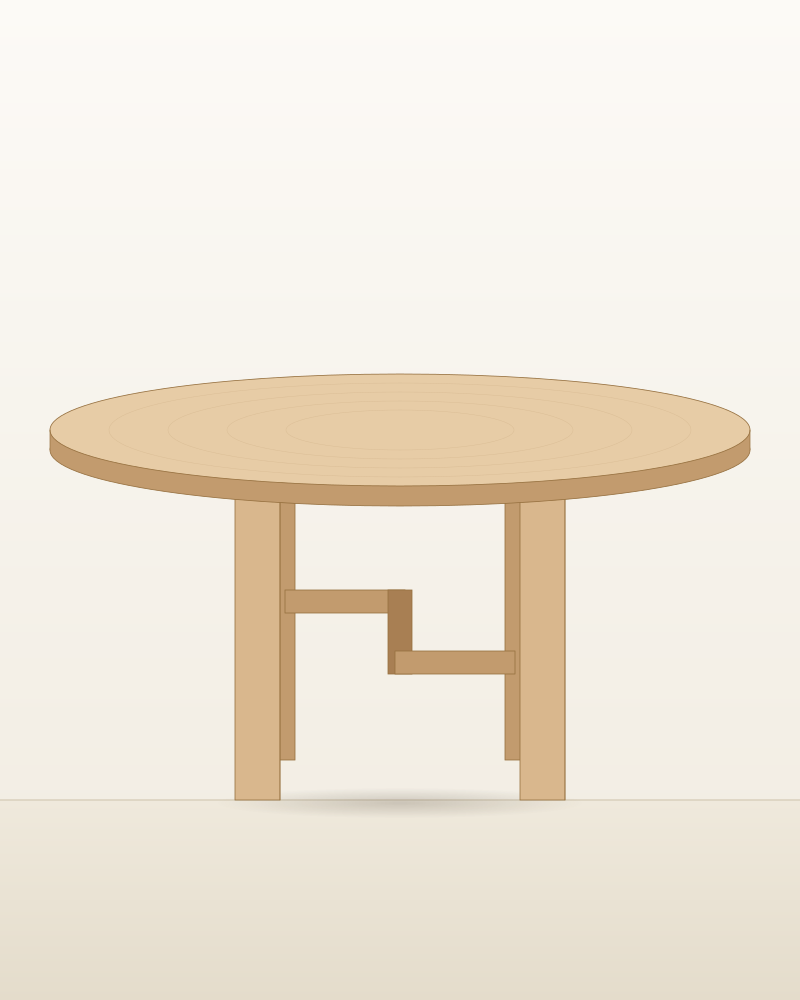

# Bronze Age Furniture — website

A self-contained static site for **bronzeagefurniture.in**. Plain HTML, CSS and
vanilla JavaScript. No build step is required to run it, no framework, no
dependencies, no platform lock-in.

---

## Run it

Open `index.html` in a browser. That's it.

For a local server (needed only if you add features that require one):

```bash
python3 -m http.server 8000
# then visit http://localhost:8000
```

## Deploy it

Upload the whole folder to any static host. All of these work as-is:

| Host | How |
|---|---|
| **Netlify** | Drag the folder onto the Netlify dashboard |
| **Vercel** | `vercel --prod` from inside the folder |
| **Cloudflare Pages** | Connect a repo, leave the build command empty, output dir `/` |
| **GitHub Pages** | Push to a repo, enable Pages on the branch root |
| **Any cPanel / shared host** | FTP the folder into `public_html` |

Point `bronzeagefurniture.in` at whichever you choose. Nothing in the site
assumes a particular domain except `sitemap.xml` and `robots.txt`.

---

## What's here

```
index.html          Home — opens with the Inner Circle intro overlay
shop.html           Filterable catalogue, 14 pieces
craft.html          Kigumi & Sashimono / Kigoroshi / Kusabi, with diagrams
about.html          Brand story, ordering process, materials
contact.html        Enquiry form + FAQ
product/*.html      14 product pages, one per piece

assets/css/site.css Whole design system in one file, tokens at the top
assets/js/site.js   Intro overlay, forms, nav, filters, scroll reveals
assets/img/*.svg    Placeholder line-art for every piece + joinery diagrams

data/catalogue.py   Single source of truth for products
build_art.py        Regenerates the SVG artwork
build_site.py       Regenerates every HTML page
```

The two `build_*.py` scripts are **optional**. They generated the HTML; once
you're happy you can delete them and hand-edit the HTML forever. Keep them if
you'd rather add products by editing `data/catalogue.py` and re-running:

```bash
python3 build_art.py     # draws the SVGs
python3 build_site.py    # writes the HTML
```

---

## The three things to do before launch

### 1. Replace the placeholder artwork with photography

Every product image is an SVG line drawing sitting inside an `.artframe`
element. It's a drop-in slot — swap the file path and the layout doesn't move:

```html
<!-- before -->
<div class="card__art artframe ratio-4x5">
  
</div>

<!-- after -->
<div class="card__art artframe ratio-4x5">
  
</div>
```

Shoot to these ratios and nothing else needs touching:

| Where | Class | Ratio | Suggested export |
|---|---|---|---|
| Product cards | `.ratio-4x5` | 4:5 | 1200 × 1500 |
| Product page, wide pieces | `.ratio-3x2` | 3:2 | 1800 × 1200 |
| Product page, second frame | `.ratio-1x1` | 1:1 | 1400 × 1400 |
| Homepage bands / hero | `.ratio-21x9` | 21:9 | 2400 × 1030 |
| About page | `.ratio-3x2` | 3:2 | 1800 × 1200 |

Note on the reference images used to brief this design: they belong to another
furniture brand. They shaped the art direction only — none of them are in this
site, and none of them should be. Shoot your own pieces against a plain warm
wall in soft daylight and the existing layout will carry them.

### 2. Wire the forms to something real

Both the newsletter signup and the enquiry form currently validate the input and
show a confirmation message, but **do not send anything anywhere**. The single
place to change this is the marked block in `assets/js/site.js`:

```js
/* ------------------------------------------------------------------
   DEMO BEHAVIOUR ONLY.
   Replace this block with a real POST to your list provider ...
------------------------------------------------------------------ */
```

The simplest options, none of which need a server:

- **Formspree** — change `<form>` to `<form action="https://formspree.io/f/XXXX" method="POST">` and delete the JS interception for that form.
- **Mailchimp / ConvertKit / Buttondown** — `fetch()` POST to their endpoint; the code comment shows the shape.
- **Netlify Forms** — add `netlify` to the `<form>` tag if you host there.

Until this is done, treat every "message sent" confirmation on the site as
cosmetic.

### 3. Fill in the real details

Open `data/catalogue.py` and edit the `BRAND` dictionary — email, phone, city —
then re-run `build_site.py`. Or find-and-replace across the HTML:

- `hello@bronzeagefurniture.in`
- `+91 00000 00000`
- `Made to order in India`

Prices in `catalogue.py` are placeholders in INR. They render as "from ₹X" with
Indian digit grouping.

---

## Design system

All tokens live at the top of `assets/css/site.css` under `:root`. Change a
value there and it propagates everywhere.

- **Paper** `#F4F1EA` — the base surface
- **Ink** `#1A1613` — text and the footer
- **Oak** `#C9A273`, deep `#A5794A` — accents, numerals, the eyebrow rules
- **Vermilion** `#DC4527` — used once, for the intro close button
- **Serif** Cormorant Garamond — all display type
- **Sans** Inter — everything else, at 350 weight

Fonts load from Google Fonts. If you'd rather self-host (faster, and no third
party), download both families, drop them in `assets/fonts/`, and replace the
`<link>` in each page's `<head>` with an `@font-face` block. The fallback stacks
are already set, so the site stays legible either way.

## Accessibility & behaviour notes

- Every interactive element has a visible focus ring.
- `prefers-reduced-motion` is respected — reveals and transitions switch off.
- The intro overlay shows once per browser session, closes on the X, on the
  "Enter the site" link, on `Escape`, and shortly after a successful signup. It
  uses `sessionStorage` wrapped in try/catch, so it degrades rather than breaking
  in private modes.
- With JavaScript disabled: the intro never appears (the site is fully
  reachable), filters show all pieces, and forms fall back to normal submission.
- Shop filters write to the URL hash, so `shop.html#seating` is linkable.

---

## Adding a product

1. Add a dictionary to `PRODUCTS` in `data/catalogue.py`. Copy an existing one —
   the fields are `slug`, `name`, `category`, `kind`, `price`, `art`, `lede`,
   `story`, `joinery`, `dims`, `material`, `finish`, `lead`, and optional
   `featured`.
2. If it's a new shape, add a drawing function to `build_art.py` and register it
   in `PIECES` — or just point `art` at an existing drawing and replace the image
   with a photograph later.
3. Run both build scripts.

The shop grid, the filters, the "goes with" blocks, the contact form's product
dropdown, and `sitemap.xml` all read from that one list.
